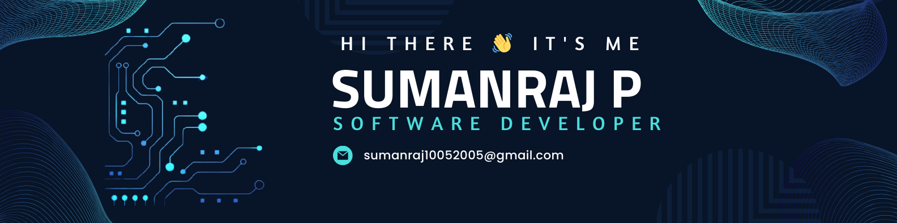

Software Engineer and Full Stack Developer

- 🔭 Here's my [portfolio]()                                                 
- 🌱 I’m currently learning DSA and MERN
- 👯 I’m looking to collaborate on Software Development
- 💬 Ask me about Tech
- 📫 How to reach me :
   
- 😄 Pronouns: Techie

### I code in
      
     

### IDE and Tools I Use
       

###

  
  

###

<picture>
  <source media="(prefers-color-scheme: dark)" srcset="https://raw.githubusercontent.com/Sumanraj-P/Sumanraj-P/output/github-snake-dark.svg" />
  <source media="(prefers-color-scheme: light)" srcset="https://raw.githubusercontent.com/Sumanraj-P/Sumanraj-P/output/github-snake.svg" />
  
</picture>